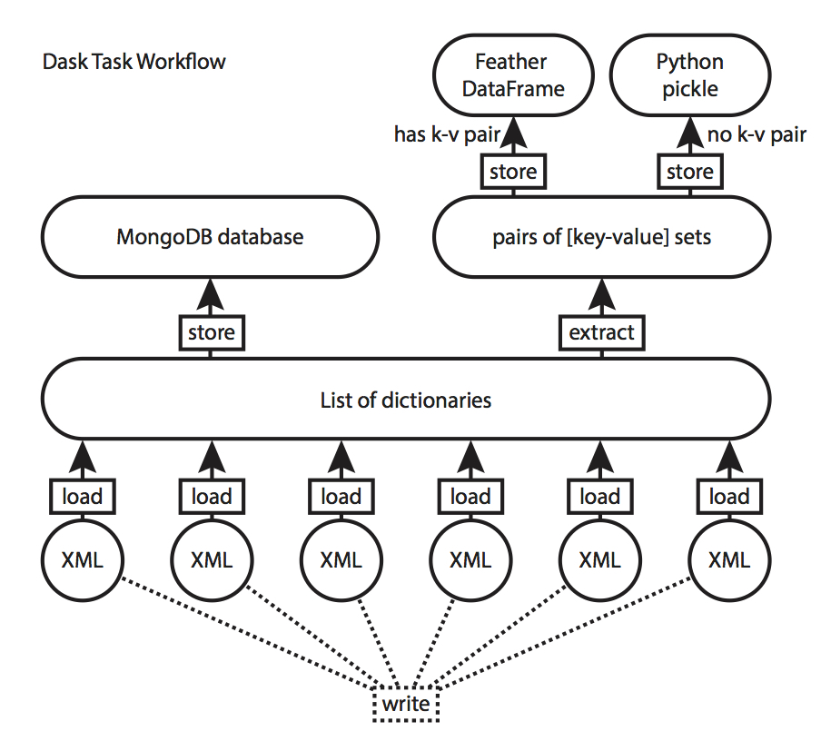
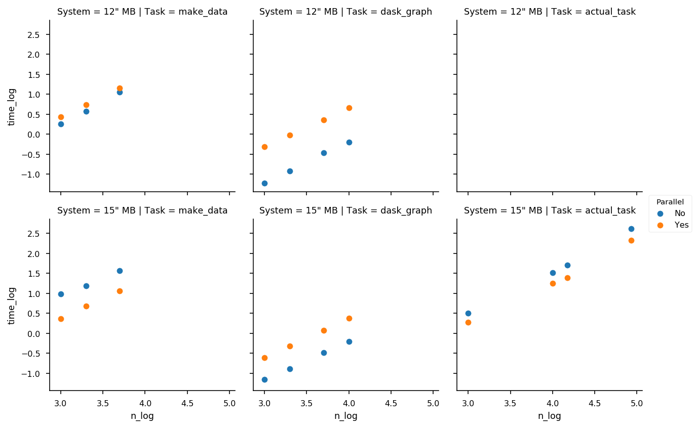

# Profiling Dask

**Note to reader:** This is the first of however many blog posts I might write about using tools at work. Because of the nature of my work, I have to keep things confidential - no specifics allowed. As such, I have opted to use toy examples here - but do know that the programming pattern is generalizable beyond what I myself am doing!

For work, I recently had an excuse to start trying out Dask for parallel processing of data. There's a commercially-licensed database at work which I have access to, for which an API is actively being developed, but for which a database dump is much more easy to access. Turns out... the database dump is a zipped up file of on the order of hundreds of thousands of XML files. (!!!!!!!!!) Who would have thought, eh!

After getting familiar with the schema, which FWIW is essentially deeply nested key-value pairs, I decided that in order to extract the relevant data that I wanted from the XML dump, I should try processing them in parallel. I've tried out other parallel processing modules before, such as joblib, and found it to be pretty usable, but as I now wanted to try doing something fancier (and not merely just embarrassingly parallel tasks), I decided to try out Dask. Here's my report on how it went, plus a little bit of profiling at the end.

First off, what's the task that I'm trying to do? It basically boils down to the following steps:

- Load each XML file into memory.
- Convert each XML file into a dictionary.
- Grab out pairs of keys from each XML file.
    - For XML files that have that pair of keys, if there are multiple values in each key, then extract them individually.
    - For XML files that don't have that pair of keys (both must be present), keep them in a separate list so that I can analyze them later.
- In a separate fork of the task, after each XML file is loaded as a list of dicts, commit them into a local MongoDB so that I can query it easily.

This task visually looks like the following flow diagram:

This is a network representation of the tasks. The rounded pills/circles are the nodes, and represent objects in memory or files on disk, while square boxes that label the edges between nodes indicate functions that are applied to those items. We call this a **DAG**, or a "Directed Acyclic Graph". It is directed, in that there are edges with directionality between nodes indicating flow of information; it is acyclic, in that there are no cycles in the graph (we cannot start at a node and come back to it), and it is a graph, which is the academic name we give to networks. If you're interested in network science (more generally), check out my courses on Network Analysis on DataCamp!

Now, in this DAG, the bottom two layer's tasks (writing a bunch of XMLs and loading a bunch of XMLs) are trivially parallelizable - it is what we call an "embarrassingly parallel problem", where the exact same function (in this case, a "load XML" function) gets applied to every element in a list. This is the kind of problem for which I could use a variety of local parallelization libraries, including stuff from the Python standard library (multiprocessing module), or other libraries with higher-level APIs, such as [joblib]. In this case, I integrated this as part of my Dask workflow. On a local machine, what happens is something like this: Dask farms out the tasks to each of your CPU cores, so if you have a quad-core processor, it’ll basically farm out 1/4 of the data to each core (the reality is probably more complicated, of course).

[joblib]: https://pythonhosted.org/joblib/

Where it gets interesting is where we fork off the two tasks. By right, I could have done everything in serial - start with storing in MongoDB, then extracting pairs of "key-value" sets, then storing a Feather dataframe, then storing the Python pickle. However, that wouldn't be particularly interesting, wouldn't it? If I have 4 cores on my computer, then I theoretically could execute the extraction step in parallel with the MongoDB insertion step, while also parallelizing the two final storage steps with no issues. Basically, once a CPU core is freed, it will farm out the next task in the DAG to that CPU, and so on, until all of the terminal nodes in the DAG have been reached.

So, how does Dask stack up? Let's go ahead and explore the profiling tasks I've designed to see how this works, and figure out how things scale.

## Compute Systems

I first tested my code on personal 12" MacBook (Late 2016), equipped with a 1.2GHz Core m5 processor, 8GB of RAM, and 512GB SSD. This is essentially a 2-core machine.

I then tested my code on my work 15" MacBook (2017), equipped with a 2.7GHz Core i7 processor, 16GB of RAM, and 512GB SSD. This is essentially a 4-core machine (TODO CHECK).

## Profiling Tests

I designed three profiling tests. The first two are "toy" tests, for which I provide code on the GitHub repository. The third test is one the is from work; because I am using a proprietary database and wrote the code on company resources, I do not provide them here, but only show the results.

The first profiling task is creating a 1,000-10,000 XML files on disk from a set of 1,000-10,000 randomly created nested dictionaries. This one I call `make_data`.

The second profiling task is loading between 1,000-10,000 of the created XML files, converting them to a dictionary in memory, and computing some summary statistics on them. This one is called `dask_graph`.

The third profiling task is loading between 1,000-80,000 XML files on disk, extracting pairs of key-value sets, and returning them. It falls under the right-side branch of the diagram above. This task is called `actual_task`.

## Results

The results of testing are shown below.

A few points to note before we go on:

1. 12" MB + actual_task does not exist, because the 12" MB is my personal and not work computer.
1. Blue is for "serial" processing, while orange is for "parallel" processing.
1. X- and Y-axes are log10-transformed.
1. Parallel processing performs better when orange is below blue.

### Performance on 12" MB

Dask parallel processing performed about 2X slower than serial processing on the 12" MacBook (12" MB) on the `make_data` task. Just like the 15" MB (below), Dask parallel processing was about 10X slower than `dask_graph`.

There is a logical explanation for this. `dask_graph`’s individual computation steps are really fast, thus contributing to sub-second total compute times overall. Dask’s parallelism introduces a time overhead (~milliseconds range) in the process. For tasks that finish really fast (such as the `dask_graph` task), it makes no sense to use parallelism.

I also think the presence of only 2 cores on my 12" MacBook meant that system resources were being underutilized overall. Though I did the test while plugged into power, the computer was in a semi-warm state, so my unconfirmed guess is that there’s some measure of throttling going on. This does highlight the problems with using wall clock times to profile too.

### Performance on 15" MB

Dask parallel processing performed well on the 15" MacBook Pro (15" MB) on the `make_data` and `actual_task` tasks. It did not perform better on the dask_graph task, being about 10X slower, just as with the 12" MB.

On the other hand, Dask parallel processing did really well for actual_task (my work task), performing twice as fast as serial processing of the data. I was really happy about this !It meant that, on larger datasets and more complicated tasks, Dask has the potential to shave of hours off computation time, if written properly.

Of course, there's a bit of an irony to me measuring all of this and systematically profiling Dask tasks. I will admit - on actual_task, it's basically the difference between 2 minutes and 4 minutes, which is wayyy shorter than it took for me to systematically profile and write this blog post. Oh, the things we programmers do!

## Take-homes

I think there’s some clear take-homes: don't parallelize prematurely, and use Dask when you have at least multiple cores available.

Let’s talk about that first point: **don't parallelize prematurely**. It falls under that umbrella of "premature optimization is the root of all bad code". If a 10K loop takes sub-seconds to complete, don't go and parallelize it; it's sufficiently humanly interactive at that point.

Let's talk about that second point: **make sure you have multiple cores (minimum)**. Dask scales well from single node (multiple cores) to multi-node (potentially with multiple cores each). It means we can parallelize tasks on multi-core machines and gain speed-ups easily — of course conditioned on the task runtimes being bottlenecked by CPU runtime.
